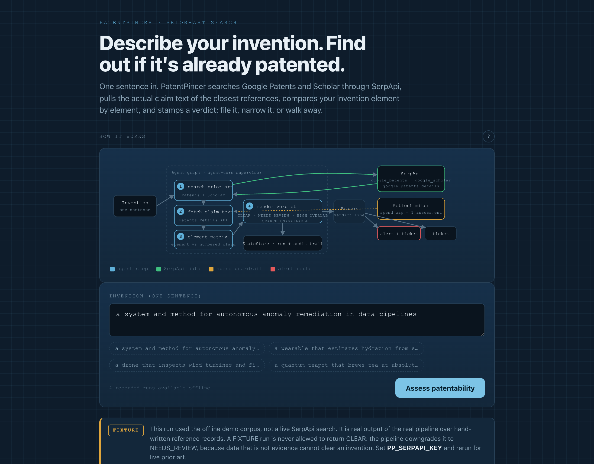
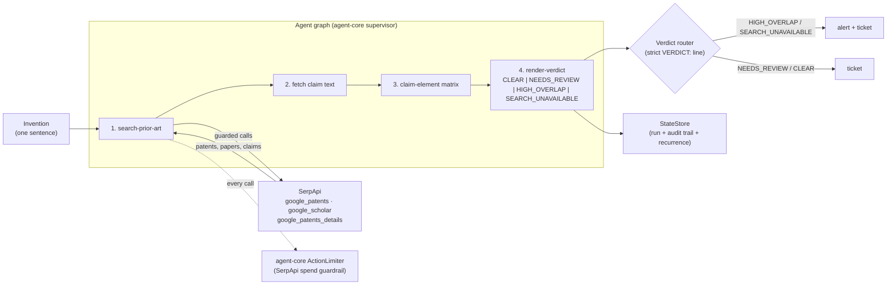

# PatentPincer

An autonomous patentability analyst. Describe an invention in one sentence and
PatentPincer searches the prior art, pulls the **claim text** of the closest
references, compares your invention **element by element**, and hands back a
decision-ready verdict with citations: file it, narrow it, or walk away.

Built for the **DevNetwork [API + Cloud + AI] Hackathon 2026**, SerpApi **Best AI
Use Case** track. SerpApi's Google Patents, Google Patents Details and Scholar
engines are the load-bearing data backbone; the agent layer is the analyst on top.



## The problem

A prior-art search is the first thing a founder needs and the last thing they
can afford. A patent attorney charges four figures and takes a week to tell you
whether your idea is already patented. Most founders skip it and find out the
expensive way, after they have built. PatentPincer collapses that first search
into a minute.

## What it does

```bash
patentpincer assess "a wearable that estimates hydration from sweat conductivity"
```

1. **Search prior art.** Google Patents through SerpApi, with 2-3 phrasings of
   the invention to widen recall, plus one Scholar query for non-patent
   literature.
2. **Fetch the claims.** For the shortlist, SerpApi's Google Patents **Details**
   engine returns the numbered claims. Titles and snippets are not claims, and
   an element-by-element comparison that reads snippets is guessing.
3. **Compare element by element.** The invention is split into claim elements;
   each element is scored against every numbered claim of every reference. Each
   cell names the reference, the claim number, the terms that matched and the
   excerpt they matched in.
4. **Render and route the verdict.** `CLEAR`, `NEEDS_REVIEW`, `HIGH_OVERLAP` or
   `SEARCH_UNAVAILABLE`, routed by a strict parse of the first line: a likely
   collision or a failed search raises an alert and opens a ticket, anything
   else opens a ticket.

## The rules that make the verdict trustworthy

A patentability tool that answers when it does not know is worse than no tool.
Four rules are enforced in `main.py` and pinned by tests:

| Situation | Verdict |
| --- | --- |
| No Google Patents search succeeded (guardrail suppressed it, timeout, bad key, quota) | `SEARCH_UNAVAILABLE`, alerted. A search that did not happen is not a clearance. |
| Searches ran but returned zero references | `NEEDS_REVIEW`. An empty reference set scores 0 of N elements disclosed, which would read as the strongest possible `CLEAR` off the weakest possible evidence. |
| References found but no claim text retrieved | `SEARCH_UNAVAILABLE`. There is nothing to compare against. |
| Evidence came from the offline demo corpus, not live SerpApi | a computed `CLEAR` is downgraded to `NEEDS_REVIEW`. Fixture data can warn you off an idea; it cannot clear one. |

Every reference and every call carries its provenance: `ok` (live SerpApi) /
`fixture` (offline demo corpus) / `fixture_unavailable` / `suppressed` / `error`.
Only `ok` is evidence. The run record keeps the full SerpApi call ledger, so the
verdict can always be traced back to the calls that produced it.

## Architecture



## Why SerpApi is load-bearing

The whole product is only as good as its prior-art coverage, and that coverage is
SerpApi. Google Patents gives structured, current patent records (assignee,
priority date, links) that you cannot scrape reliably yourself; the Details
engine gives the numbered claims the comparison actually reads; Scholar catches
the non-patent literature that anticipates just as many claims. Remove SerpApi
and there is no evidence left to reason over, which is exactly why the pipeline
refuses to emit a verdict when a SerpApi call did not succeed.

The three tools are also served over **MCP** (`python -m patentpincer.mcp_server`)
so other agents can reuse the same guarded backbone. Each tool takes an explicit
`run_id` because a separate process cannot see the caller's run context; pass it
to have the calls booked into that run's spend cycle.

## How it is built

PatentPincer runs on **agent-core**, a small reusable core for autonomous
multi-agent products on Google ADK:

- **Skills to agents.** Each step is a named skill assembled into an ADK
  supervisor that delegates in order.
- **API spend is a guardrail.** Every SerpApi call passes an `ActionLimiter`
  check, and the per-cycle cap is sized to exactly one assessment (query
  variants + 1 Scholar + claim fetches), so a runaway loop cannot burn credits.
  `PP_DRY_RUN=on` suppresses live calls entirely, and a suppressed search fails
  closed rather than quietly producing a verdict.
- **The verdict is a contract, not prose.** The router parses
  `^VERDICT: (CLEAR|NEEDS_REVIEW|HIGH_OVERLAP|SEARCH_UNAVAILABLE)$` from the
  first line. A brief that reads "VERDICT: CLEAR / no high overlap was found"
  routes as a clearance, not a collision, and an unparseable brief is routed for
  a human instead of guessed at.
- **The state store is process-scoped**, so a second assessment of the same
  invention is detected as a recurrence and every run ends `completed` or
  `error`.

## Run it

```bash
pip install -e ../../packages/agent-core     # the reusable core
pip install -e .                             # PatentPincer

export PP_SERPAPI_KEY=...        # optional: live SerpApi data (free tier works)
# GOOGLE_CLOUD_PROJECT + ADC     # optional: the LLM analyst narrative

patentpincer assess "your invention in one sentence"
patentpincer assess "..." --no-llm           # deterministic analyst, no GCP
patentpincer assess "..." --json             # full run record: matrix + call ledger
patentpincer export-demo                     # replay the demo cases into the UI
```

## What is demonstrated, and what is not

Being precise about this, because a patentability claim is not the place to be
vague:

- **Demonstrated without any key:** the whole pipeline, end to end. The
  element-by-element matrix, the verdict arithmetic, the strict verdict parse and
  routing, the spend guardrail, the run store, the event stream, the call ledger,
  and all four fail-closed rules. `ui/index.html` is generated by
  `patentpincer export-demo`; every timing, status, claim excerpt and brief in it
  came out of a real run, and a test re-runs those cases and compares.
- **Not funded here:** we have no paid SerpApi key and no GCP project, so no run
  in this repo carries `provenance: LIVE` and no LLM narrative was generated.
  The live branch is covered by tests with a faked `urlopen` (success, API-level
  error, timeout, zero results, missing claims), which exercises the request
  construction, the response parsing and the provenance labelling, but it is not
  the same as a real key against real Google Patents. With `PP_SERPAPI_KEY` set,
  the same code path calls SerpApi and the badge reads LIVE.
- **Not a legal opinion.** The comparison is transparent term containment over
  claim text with light stemming, not a trained model: a first-pass screen that
  shows its work so a reviewer can overrule any cell. It informs a filing
  decision; it does not replace counsel.

## Tests

```bash
pytest tests -q
```

38 tests, no network and no API key (the suite forces `PP_OFFLINE` and in-memory
state). They cover: offline records are labelled `fixture` and never `ok`; the
corpus refuses queries it does not cover; the `before` cutoff and `assignee`
filters are really applied and an unparseable cutoff is an error; the Details
engine yields numbered claims and matrix cells quote them; dry-run, timeout,
API-level error, zero results and missing claim text each fail closed instead of
clearing; a fixture `CLEAR` is downgraded while a live one is not; the router
handles the "CLEAR mentions high overlap" case and refuses malformed briefs;
concurrent assessments keep separate ledgers and budgets; an explicit `run_id`
beats the ambient context; the MCP server really boots and serves the three
tools over stdio; runs end `completed` or `error`; and
the shipped UI replays runs that reproduce exactly.

## Paper, deck & UI

- **Paper:** `paper/paper.tex` (build: `tectonic paper/paper.tex` or Overleaf).
- **Deck:** `deck/deck.md`, a marp slide deck (build: `marp deck/deck.md --pdf`).
- **UI:** `ui/index.html`, a static replay of recorded runs (opens offline, no
  server). It will not show a verdict for an invention it never assessed.

## Cite

```bibtex
@software{sarkar_patentpincer_2026,
  title  = {PatentPincer: an autonomous patentability analyst over SerpApi prior art},
  author = {Dipankar Sarkar},
  year   = {2026},
  url    = {https://github.com/doom2quake/patentpincer},
  license = {MIT}
}
```

## License

MIT. See [LICENSE](LICENSE).

## Paper and deck

Read the write-up in [`paper/paper.pdf`](paper/paper.pdf) and the slides in [`deck/deck.pdf`](deck/deck.pdf).
